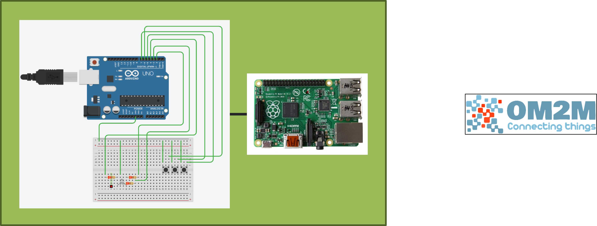

# OM2M_FCIN_TESTSUITE

Test code for OM2M_FCIN_TESTSUITE

## Introduction
OM2M IoT platform that follows oneM2M(ref. [http://www.onem2m.org]http://www.onem2m.org) standard

    git clone https://github.com/seslabSJU/OM2M_FCIN_TESTSUITE

## Setting highlevel architecture
ready your arduino UNO board, raspberrypi and OM2M platform

### logical

### physical

### Test Environment

## Setting for arduino
ready your arduino UNO board and build up circuit board like picture below and then upload [arduino.ino](arduino/arduino.ino) file

## Setting for raspberrypi
ready your server computer for connect with arduino UNO board and then execute command below

    cd OM2M_FCIN_TESTSUITE
    pip3 install -r requirements.txt
    cd raspberrypi
    python3 main.py

## View of Test

